<div align="center">


# Flash Learn

**Spaced-repetition flashcards with rich cards, collections, quizzes and community decks.**

Flash Learn turns what you want to learn into flashcards and schedules each review just before you would forget it.
Web app, installable as a PWA, in English and Brazilian Portuguese.

[](https://flashlearn.princeneres.dev)
[](https://react.dev)
[](https://www.typescriptlang.org)
[](https://vitejs.dev)
[](https://neon.com)
[](LICENSE)

[Live app](https://flashlearn.princeneres.dev) ·
[Features](#features) ·
[Screenshots](#screenshots) ·
[Self-hosting](#getting-started) ·
[MCP server](mcp-server/README.md)

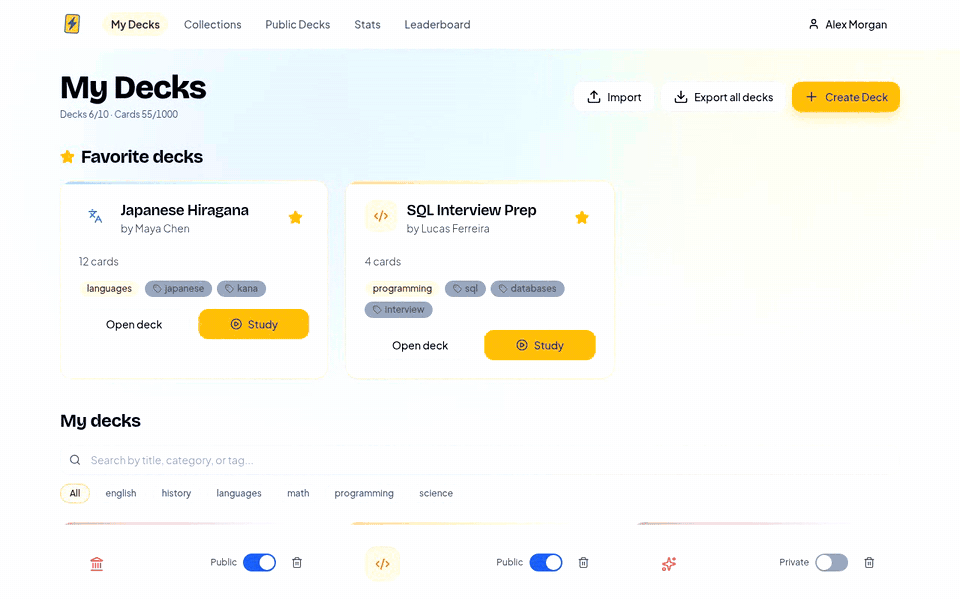

</div>

## Features

**Study**

- **Spaced repetition.** An SM-2-based scheduler with Anki-style learning and relearning steps. Every deck can
  tune its own steps, interval cap and daily new-card limit.
- **Four-button grading** (Again, Hard, Good, Easy), with the next interval shown on each button.
- **Cloze deletions** (`{{c1::answer}}`) and **type-the-answer** cards for active recall.
- **Rich cards.** TipTap editor with headings, lists, code blocks, links, images, audio and KaTeX math.
- **Keyboard and touch friendly.** <kbd>Space</kbd> reveals, <kbd>1</kbd>–<kbd>4</kbd> grade, and the session
  layout fits phone screens.

**Organize**

- **Collections** group related decks and hold **quizzes** with single-choice, multiple-choice and true/false
  questions, explanations and a pass threshold.
- **Public decks.** Publish a deck, browse and favorite decks from other learners, or copy one into your account.
- **Import and export** decks, media included, as portable `.fldeck.zip` bundles.
- **MCP server.** Create decks, collections and quizzes from Claude or any MCP client. See
  [`mcp-server/`](mcp-server/README.md).

**Stay consistent**

- **Statistics:** reviews over time, study heatmap, accuracy, due forecast, new vs. review, best study hours and a
  category breakdown.
- **Gamification:** points, daily streaks, achievements and a leaderboard. Scores are computed server-side so
  they can't be forged from the browser.
- **Installable PWA** with offline support, **light and dark themes**, sound effects and **English / Portuguese**
  translations.

**Accounts**

- Email and password, Google and GitHub sign-in, and password reset by email.
- Every table is protected by Postgres Row Level Security. Plan quotas are enforced by database triggers.

## Screenshots

| Dashboard                                                                              | Study session                                                    |
| -------------------------------------------------------------------------------------- | ---------------------------------------------------------------- |
| 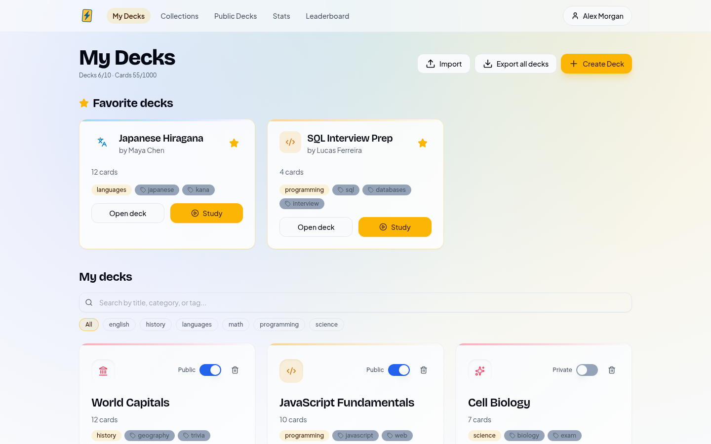  | 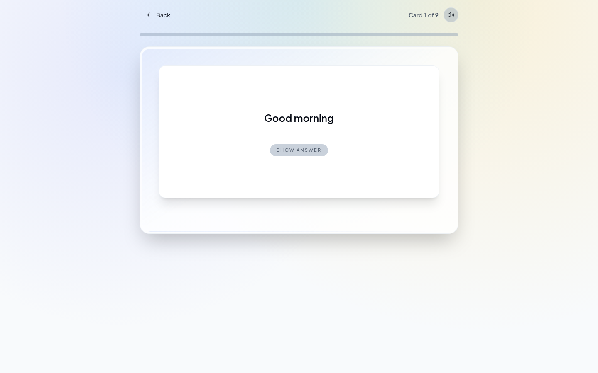 |
| **Statistics**                                                                         | **Leaderboard**                                                  |
| 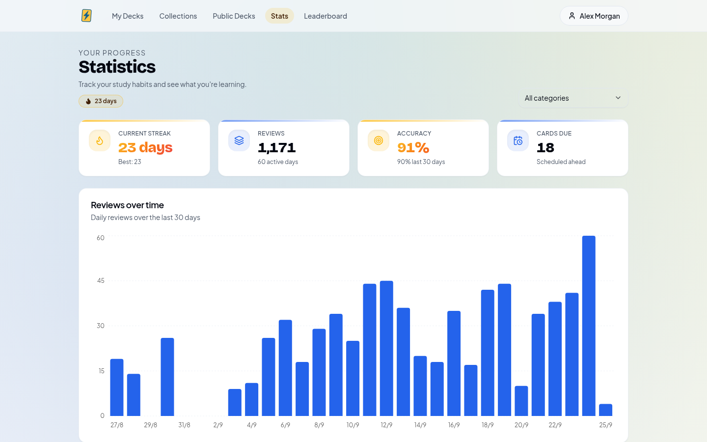 | 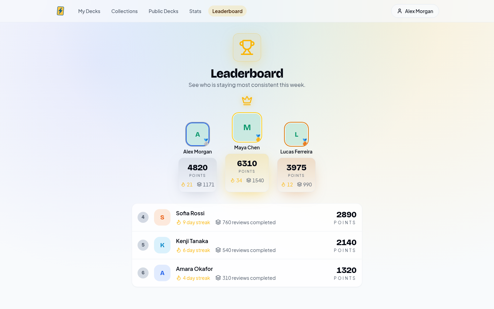          |
| **Collection with decks and a quiz**                                                   | **Quiz**                                                         |
| 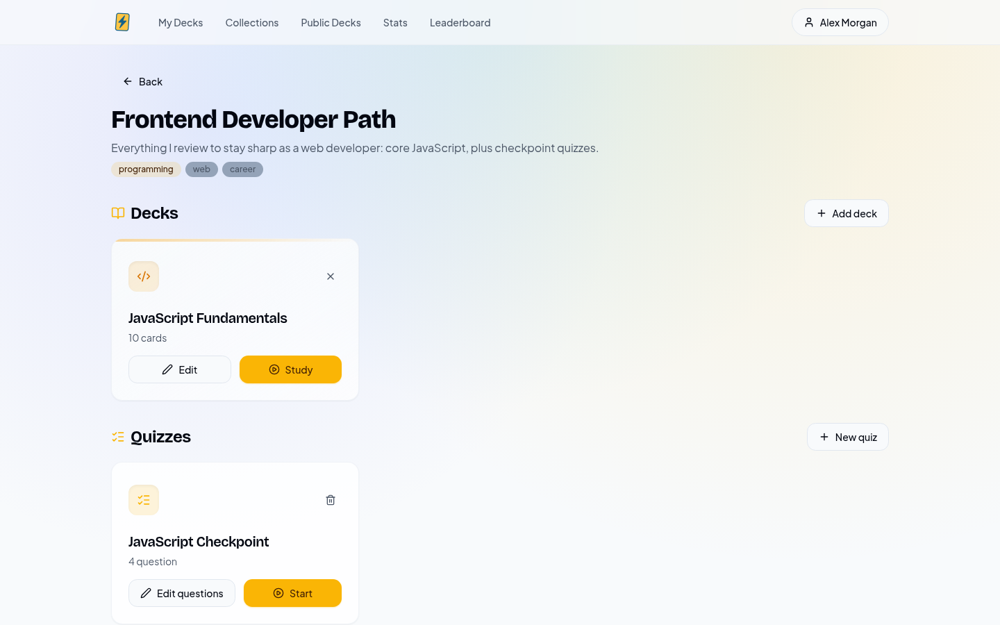                                  | 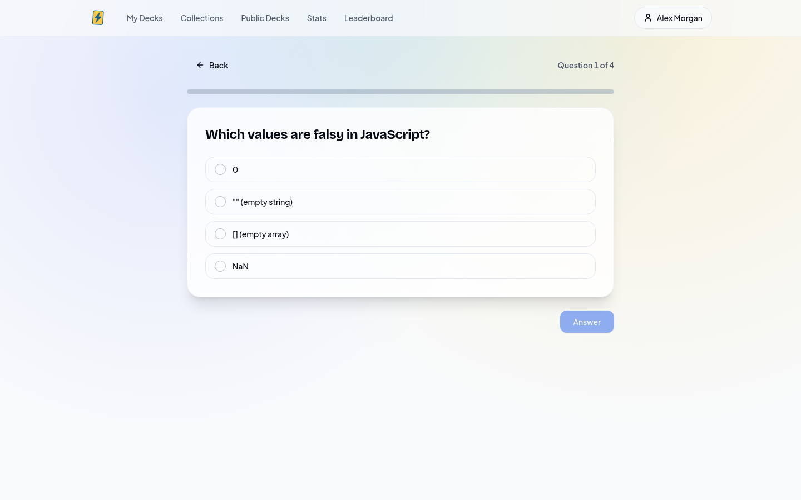      |
| **Public decks**                                                                       | **Deck editor**                                                  |
| 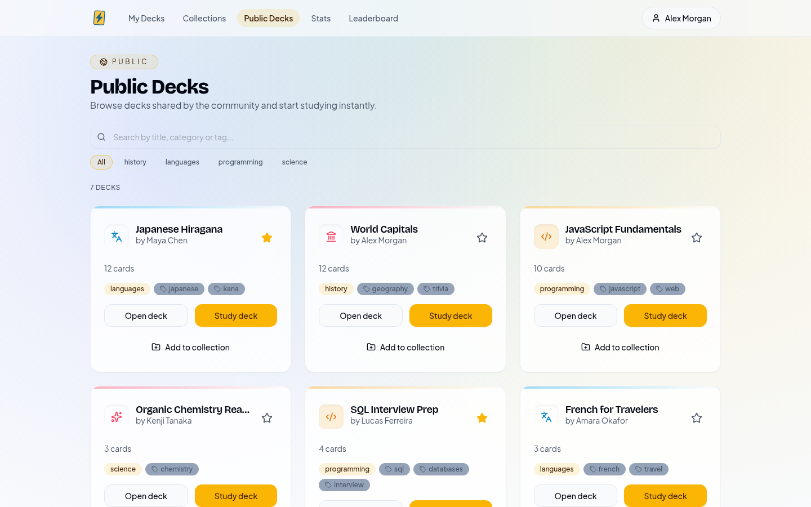                                        | 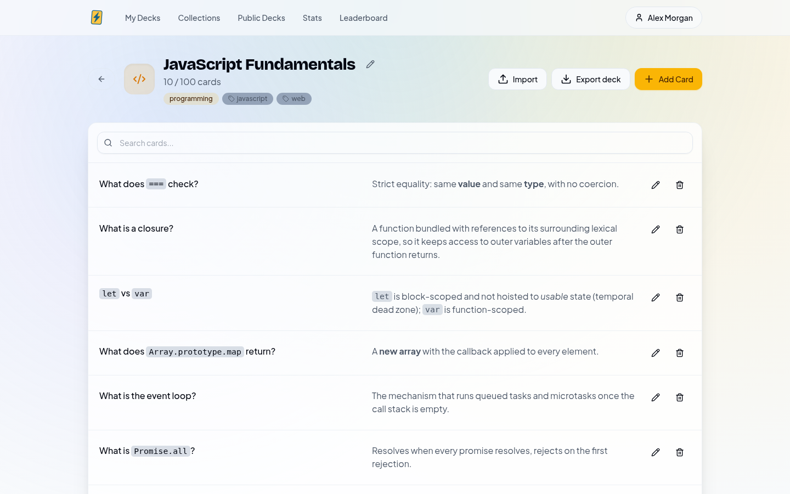         |

<details>
<summary><strong>Dark mode, mobile and landing page</strong></summary>

| Dark dashboard                                                 | Dark statistics                                             |
| -------------------------------------------------------------- | ----------------------------------------------------------- |
| 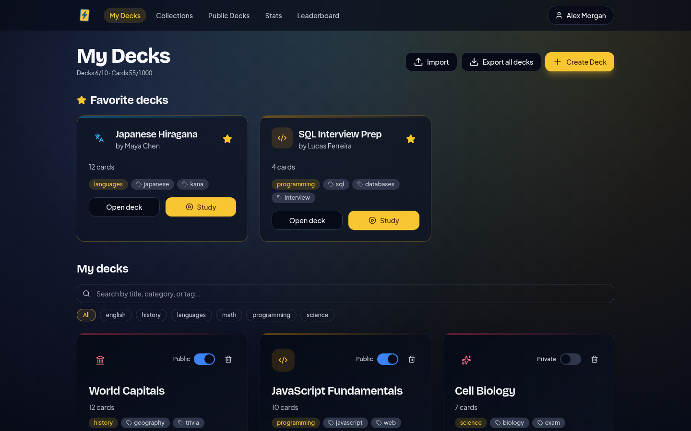 | 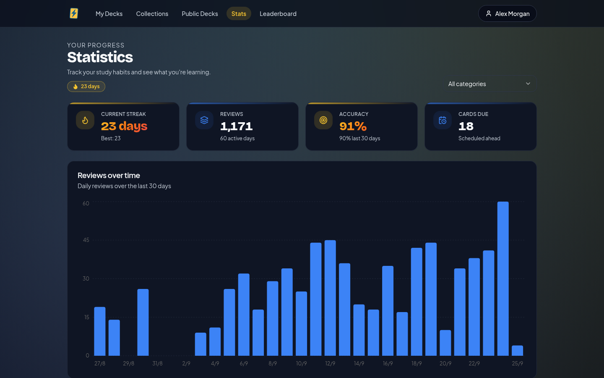 |

<p>
  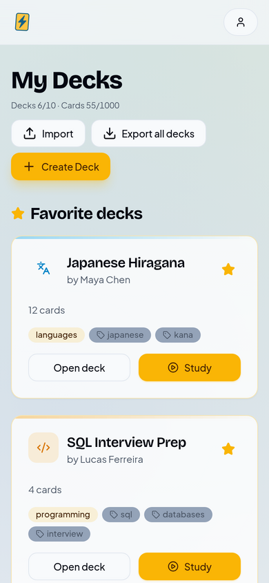
  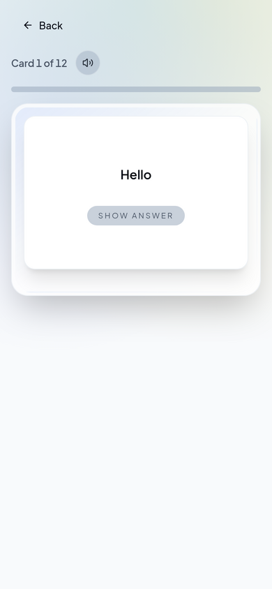
  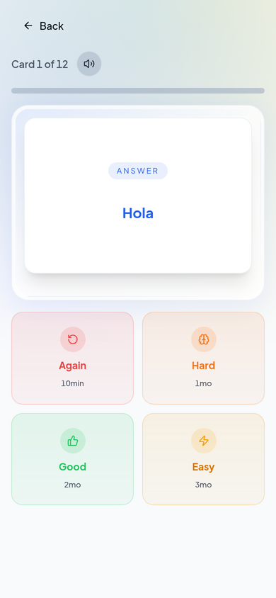
</p>

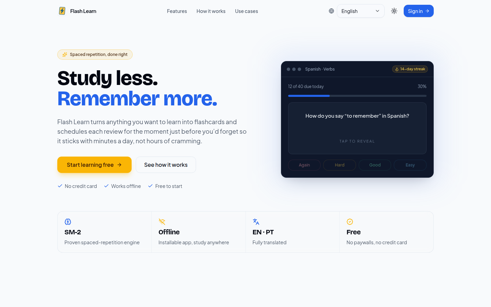

</details>

> The screenshots use fictional demo accounts and data.

## Tech stack

| Layer    | Tools                                                                          |
| -------- | ------------------------------------------------------------------------------ |
| Frontend | React 19, Vite 7, TypeScript 5, React Router 7                                 |
| UI       | Tailwind CSS, Radix UI primitives, lucide-react, Recharts                      |
| Editor   | TipTap 3, KaTeX, DOMPurify                                                     |
| Backend  | Neon: Postgres with RLS, Neon Auth, Data API, object storage; Vercel Functions |
| i18n     | i18next, react-i18next                                                         |
| PWA      | vite-plugin-pwa, Workbox                                                       |
| Hosting  | Vercel (SPA + `api/` functions)                                                |

## Getting started

### Prerequisites

- [Node.js](https://nodejs.org) 20+ and [pnpm](https://pnpm.io) 10+
- A [Neon](https://neon.com) project (the free plan is enough) with **Neon Auth**, the **Data API** and
  **Object storage** enabled
- `psql`, to apply the migrations

### 1. Install

```bash
git clone https://github.com/princeneres/flash-learn.git
cd flash-learn
pnpm install
```

### 2. Configure

Copy `.env.example` to `.env.local` and fill it in from the Neon Console (**Connect** dialog of your branch):

| Variable                                                  | Where                                |
| --------------------------------------------------------- | ------------------------------------ |
| `VITE_NEON_AUTH_URL`, `NEON_AUTH_JWKS_URL`                | Settings → Auth                      |
| `VITE_NEON_DATA_API_URL`                                  | Data API                             |
| `DATABASE_URL`                                            | Connect → Postgres database          |
| `S3_ENDPOINT`, `S3_ACCESS_KEY_ID`, `S3_SECRET_ACCESS_KEY` | Object storage → Connect → S3 client |

In the Neon Console:

1. **Object storage:** create a private `media` bucket and a public `avatars` bucket.
2. **Settings → Auth:** add your production domain to the trusted domains and allow localhost for development.
3. **Settings → Auth → OAuth providers:** Google works with Neon's shared keys; add GitHub with your own OAuth app.

### 3. Create the database

```bash
pnpm db:migrate   # applies db/migrations/*.sql to DATABASE_URL
pnpm db:types     # regenerates src/types/database.ts
```

Deck and card quotas come from the `plans` table. The migration seeds a `free` plan (10 decks, 100 cards per deck,
1,000 cards in total) and a `pro` plan; tune the limits there.

### 4. Run

```bash
pnpm dev          # http://localhost:5173 (also serves api/ functions)
pnpm build        # type-check and production build
pnpm preview      # serve the production build
pnpm lint         # ESLint
pnpm format       # Prettier
```

### Server functions

`api/` holds Vercel Functions: `storage` (presigned URLs for media and avatars) is required; the others power optional
features. They read their configuration from environment variables (`.env.local` locally, `pnpm env:add` on Vercel):

| Function                                                | Feature                                                         | Secrets                                                                                                     |
| ------------------------------------------------------- | --------------------------------------------------------------- | ----------------------------------------------------------------------------------------------------------- |
| `feature-suggestion`                                    | In-app suggestion form, delivered by email                      | `RESEND_API_KEY`, `SUGGESTIONS_TO_EMAIL`, `SUGGESTIONS_FROM_EMAIL`                                          |
| `ai-generate`                                           | AI deck generation with per-use credits (UI currently disabled) | `OPENAI_API_KEY`, `OPENAI_MODEL`                                                                            |
| `buy-credits`, `create-subscription`, `abacate-webhook` | Billing through AbacatePay (UI currently disabled)              | `ABACATEPAY_API_KEY`, `ABACATEPAY_WEBHOOK_SECRET`, `ABACATEPAY_SIGNING_KEY`, `ABACATE_PRODUCT_*`, `APP_URL` |

They deploy with the app (`pnpm deploy`).

## Security model

- **Row Level Security everywhere.** Users can read and write only their own rows. Decks and collections marked
  public are readable by any signed-in user.
- **Server-side rules.** Points, streaks and achievements are awarded by a `SECURITY DEFINER` function, and
  direct writes to those profile fields are blocked by a trigger. Plan quotas are enforced by triggers, so they
  also apply to the MCP server and any other API client.
- **Private media.** Card images and audio live in a private `media` bucket, scoped to `<user-id>/…` paths and
  served through presigned URLs issued by `api/storage`.
- **Sanitized content.** Card HTML is sanitized with DOMPurify before rendering.
- The database owner credential and third-party API keys are used only inside `api/` functions, never in the browser.

## Project structure

```
src/
  pages/            Route views: Landing, Dashboard, DeckDetail, StudySession, Collections,
                    QuizSession, Stats, Leaderboard, PublicDecks, Profile, auth and legal pages
  components/       Card editor, rich content renderer, dialogs, stats charts, ui/ primitives
  services/         Data access and domain logic (decks, cards, collections, quizzes, stats,
                    media storage, import/export, SRS scheduler in srsAlgorithm.ts)
  hooks/            Auth flows, plan limits, PWA install prompt, sounds
  i18n/locales/     en.json and pt.json
  types/database.ts Types generated from the database schema (pnpm db:types)
api/                Vercel Functions (storage, suggestions, AI generation, billing)
db/migrations/      Schema, RLS policies, triggers and RPCs
mcp-server/         MCP server for creating content from AI assistants
docs/               Design notes and screenshots
```

## Roadmap

- [x] Collections and quizzes
- [x] Per-deck spaced-repetition settings and daily new-card limits
- [x] MCP server with browser login
- [ ] Re-enable AI deck generation
- [ ] Anki (`.apkg`) import
- [ ] Deck ratings and comments
- [ ] Swipe gestures in mobile study mode

## Contributing

Contributions are welcome. Read [CONTRIBUTING.md](CONTRIBUTING.md) first, and report vulnerabilities privately as
described in [SECURITY.md](SECURITY.md).

## License

[MIT](LICENSE)

## Acknowledgements

- [Anki](https://apps.ankiweb.net), for the scheduling ideas Flash Learn builds on
- [TipTap](https://tiptap.dev), [Radix UI](https://www.radix-ui.com) and [shadcn/ui](https://ui.shadcn.com)
- [Neon](https://neon.com), for Postgres, auth and storage
